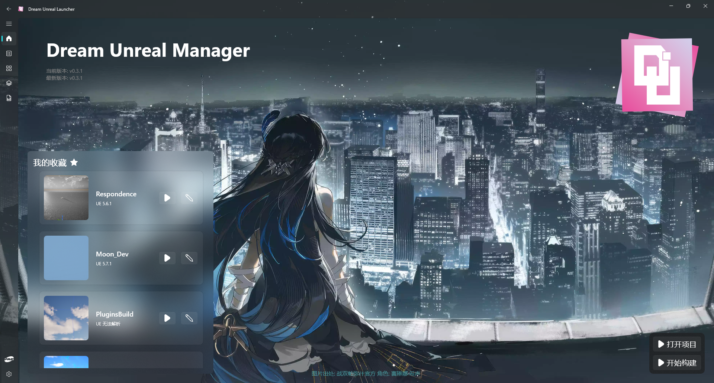
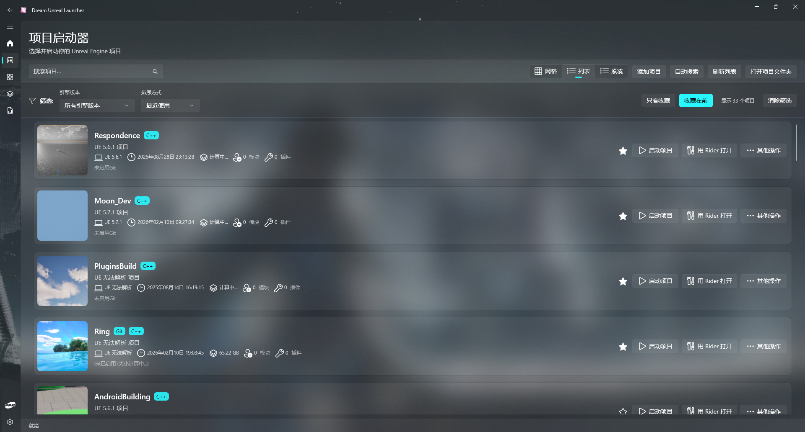
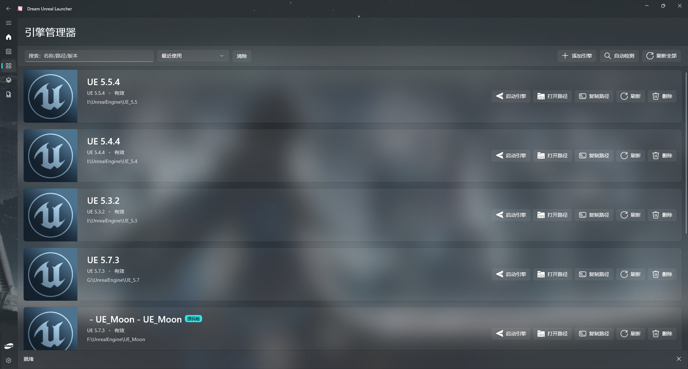
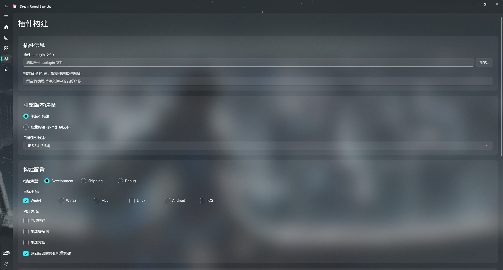
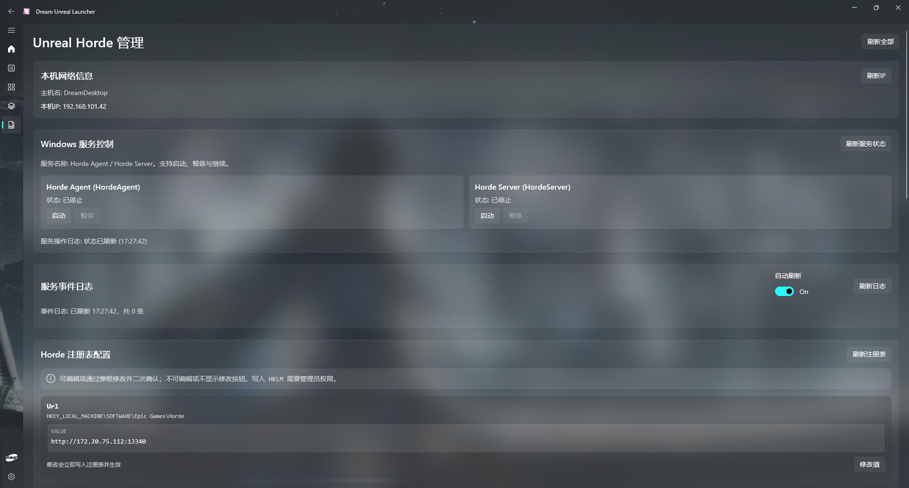
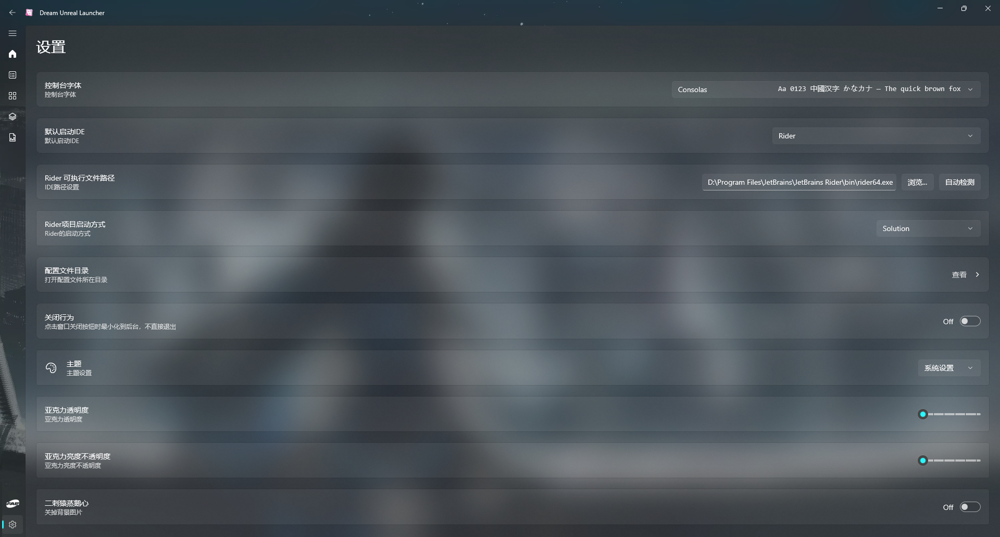

# Dream Unreal Manager

<p align="center">
  
</p>

<p align="center">
  一个基于 <b>WinUI 3</b> 的 Unreal Engine 工具箱，聚焦项目启动、引擎管理、插件构建与 Horde 运维。
</p>

<p align="center">
  
  
  
  
</p>

---

## 目录

- [项目简介](#项目简介)
- [功能概览](#功能概览)
- [Gallery](#gallery)
- [快速开始](#快速开始)
- [配置与数据文件](#配置与数据文件)
- [项目结构](#项目结构)

## 项目简介

Dream Unreal Manager 是一个桌面端 Unreal Engine 管理器，当前聚焦以下场景：

- 管理本地 `.uproject` 并快速启动
- 管理多个 Unreal Engine 安装目录
- 可视化执行插件构建（含批量构建）
- 管理 Unreal Horde 服务、日志与注册表配置
- 统一 IDE、主题、透明度等开发体验设置

## 功能概览

| 模块 | 说明 |
| --- | --- |
| Main | 首页入口、版本检查、收藏项目快捷启动 |
| Launcher | 项目列表管理、搜索筛选、收藏、引擎切换、生成 VS 工程文件 |
| Unreal Launcher | 引擎列表管理、自动检测、设置默认引擎、快速启动编辑器 |
| Plugins Build | 选择 `.uplugin`、单/多引擎构建、平台配置、实时日志与问题统计 |
| Unreal Horde | 服务状态控制、事件日志查看、注册表配置管理 |
| Settings | 默认 IDE、IDE 路径自动检测、主题、Acrylic 参数、关闭行为等 |
| Fab | 内置 WebView2 页面入口 |

## Gallery

| 主页 | 项目启动器 |
| --- | --- |
|  |  |

| 引擎管理 | 插件构建 |
| --- | --- |
|  |  |

| Horde 管理 | 设置页面 |
| --- | --- |
|  |  |

## 快速开始

### 环境要求

- Windows 10/11（建议 Windows 11）
- .NET SDK 8.0+
- Visual Studio 2022（含 WinUI / Windows App SDK 开发组件）

### 构建与运行

```powershell
dotnet restore .\DreamUnrealManager.sln
dotnet build .\DreamUnrealManager.sln -c Debug
dotnet run --project .\DreamUnrealManager\DreamUnrealManager.csproj -c Debug -f net8.0-windows10.0.22000.0
```

## 配置与数据文件

程序默认写入以下目录：

```text
%LOCALAPPDATA%\DreamUnrealManager\
```

常见文件：

- `engines.json`：引擎列表与引擎信息
- `projects.json`：项目列表
- `projects_backup.json`：项目列表备份

## 项目结构

```text
DreamUnrealManager/
├─ DreamUnrealManager/          # WinUI 主项目（Views / Services / ViewModels）
├─ DreamUnrealManager.Core/     # 核心公共库
├─ DreamUnrealManager.sln       # 解决方案
└─ README.md                    # 当前说明文档
```
